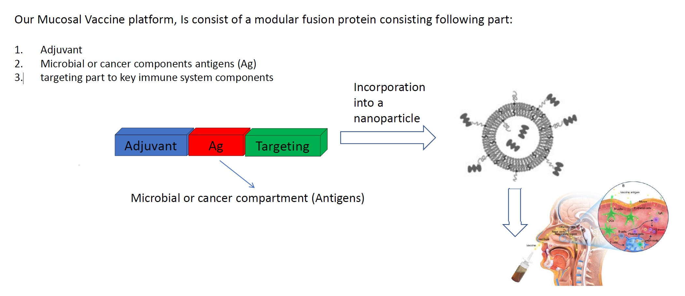
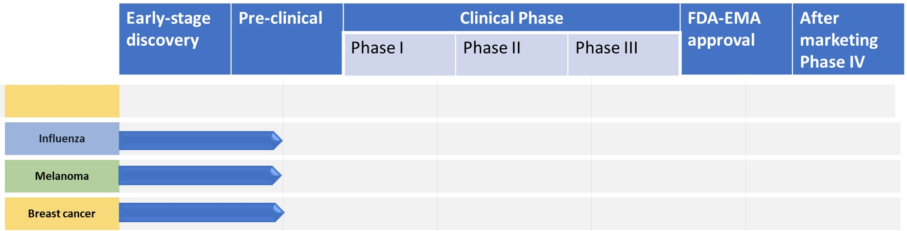

<!DOCTYPE html>
<html lang="en">
<head>
    <meta charset="UTF-8">
    <meta name="viewport" content="width=device-width, initial-scale=1.0">
    <title>Next Generation Vaccine</title>
    
</head>
<body>
    <header>
        
        <h1>Welcome to Next Generation Vaccine</h1>
    </header>
    <nav>
        <a href="#about">About Us</a>
        <a href="#products">Products</a>
        <a href="#contact">Contact Us</a>
    </nav>
    

        <section id="about">
            <h2>About Us</h2>
            
Next Generation Vaccine is committed to providing cutting-edge vaccines to safeguard public health. With our state-of-the-art research facilities and dedicated team of scientists, we strive to develop innovative solutions to combat infectious diseases.

            <h3>The Team</h3>
            

                
                

                    <h4>Mohammad Arabpour - CEO</h4>
                    
DR. Arabpour has M.Sc. in medical virology and Ph.D. in Biomedicine. He has a long career +12 years in vaccine discovery and evaluation in industry and academic Designed, created and evaluated the first Mucosal vaccine. leading the scientific strategy And drug development has extensive experience in the pharmaceutical industry and leads our company with vision and expertise.

                

            

            

                
                

                    <h4>Sara Torkzadeh - CTO</h4>
                    
Ms. Torkzadeh with M.Sc. in Biotechnology and more than 5 years of experiences in vaccine evaluation in infectious diseases. leading the scientific strategy. oversees our research and development efforts, driving innovation and excellence in vaccine technology.

                

            

            <h3>Watch</h3>
            
Learn more about our technology on YouTube: <a href="https://www.youtube.com/watch?v=kcWT8EMYwYY">Watch Now</a>
 <!-- YouTube link added -->
        </section>
        <section id="products">
            <h2>Our Technology</h2>
            
Our vaccine technology is versatile with great applications for cancer and infectious diseases. Our vaccine technology consists of several modules with specialized function. It is working as an immune enhancer boosting immune system against a specific target. Augmented immunity then could destroy cancer malignancy and protect against infectious diseases.

            
            <h3>Pipelines</h3>
            
            <ul>
                <li>Oncology Pipeline
                    <ul>
                        <li>Breast Cancer</li>
                        <li>Melanoma</li>
                    </ul>
                </li>
                <li>Infectious Disease Pipeline
                    <ul>
                        <li>Influenza</li>
                    </ul>
                </li>
            </ul>
            <h3>Publications</h3> <!-- New section for Publications -->
            <ul>
                <li>
                    Arabpour M, Lebrero-Fernandez C, Schön K, Strömberg A, Börjesson V, Lahl K, Ballegeer M, Saelens X, Angeletti D, Agace W, Lycke N. ADP-ribosylating adjuvant reveals plasticity in cDC1 cells that drive mucosal Th17 cell development and protection against influenza virus infection. Mucosal Immunol. 2022 Apr;15(4):745-761. doi: 10.1038/s41385-022-00510-1. Epub 2022 Apr 13. PMID: 35418673; PMCID: PMC9259495.
                </li>
                <li>
                    Arabpour M, et al. An adjuvant-containing cDC1-targeted recombinant fusion vaccine conveys strong protection against murine melanoma growth and metastasis. Oncoimmunology. 2022 Aug 24;11(1):2115618. doi: 10.1080/2162402X.2022.2115618. PMID: 36046810; PMCID: PMC9423856.
                </li>
            </ul>
        </section>
        <section id="contact">
            <h2>Contact Us</h2>
            
If you have any questions or inquiries, please feel free to contact us:

            
Email: mohammad.arabpour.sinior@gmail.com

            
Phone: +46-707271036

        </section>
    

    <footer>
        &copy; 2024 Next Generation Vaccine. All rights reserved.
    </footer>
</body>
</html>
