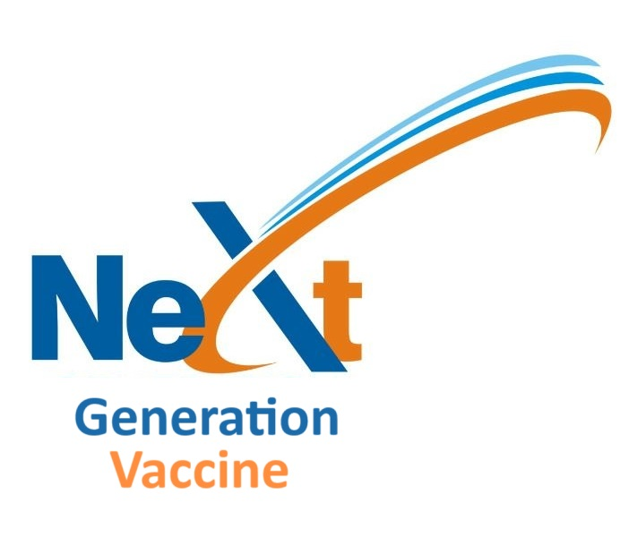

<!DOCTYPE html>
<html lang="en">
<head>
    <meta charset="UTF-8">
    <meta name="viewport" content="width=device-width, initial-scale=1.0">
    <title>Next Generation Vaccine</title>
    
</head>
<body>
    <header>
        
        <h1>Welcome to Next Generation Vaccine</h1>
    </header>
    <nav>
        <a href="#about">About Us</a>
        <a href="#products">Products</a>
        <a href="#contact">Contact Us</a>
    </nav>
    

        <section id="about">
            <h2>About Us</h2>
            
Next Generation Vaccine is committed to providing cutting-edge vaccines to safeguard public health. With our state-of-the-art research facilities and dedicated team of scientists, we strive to develop innovative solutions to combat infectious diseases.

            <h3>The Team</h3>
            <h4>Mohammad Arabpour - CEO</h4>
            
DR. Arabpour has M.Sc. in medical virology and Ph.D. in Biomedicine. Hehas  a long career +12 years in vaccine discovery and evaluation in industry and academic Designed, created and evaluated the first Mucosal vaccine. leading the scientific strategy And drug development has extensive experience in the pharmaceutical industry and leads our company with vision and expertise.

            <h4>Sara Torkzadeh - CTO</h4>
            
Ms. Torkzadeh with M.Sc. in Biotechnology and more than 5 years of experiences in vaccine evaluation in infectious diseases. leading the scientific strategy. oversees our research and development efforts, driving innovation and excellence in vaccine technology.
          
        </section>
        <section id="products">
            <h2>Our Products</h2>
            
Our vaccine technology is versatile with great applications for cancer and infectious diseases.

            
            <h3>Pipelines</h3>
            <ul>
                <li>Oncology Pipeline
                    <ul>
                        <li>Breast Cancer</li>
                        <li>Melanoma</li>
                    </ul>
                </li>
                <li>Infectious Disease Pipeline
                    <ul>
                        <li>Influenza</li>
                    </ul>
                </li>
            </ul>
        </section>
        <section id="contact">
            <h2>Contact Us</h2>
            
If you have any questions or inquiries, please feel free to contact us:

            
Email: mohammad.arabpour.sinior@gmail.com

            
Phone: +46-707271036

        </section>
    

    <footer>
        &copy; 2024 Next Generation Vaccine. All rights reserved.
    </footer>
</body>
</html>
